# 🧪 Awesome Electronic Lab Notebook (ELN) Platforms & Open-Source Ecosystem 🔬

    

> **Curated List of SaaS Platforms & Open-Source GitHub Projects**  
> *Focused on Research Data Management (RDM), Laboratory Information Management Systems (LIMS), Experiment Documentation, Sample Tracking, and FAIR Data Compliance (Findable, Accessible, Interoperable, Reusable).*

---

## 📌 Overview & SEO Highlights 🔍

An **Electronic Lab Notebook (ELN)** is digital software designed for scientists, lab managers, biopharma researchers, and academic institutions to replace traditional paper lab notebooks. ELNs streamline digital experiment tracking, protocol management, chemical structure drawing, DNA sequencing, inventory control, regulatory compliance (such as **21 CFR Part 11** and **GLP/GMP**), and **FAIR research data management**.

This repository provides an up-to-date, comprehensive ecosystem guide covering both enterprise SaaS platforms and top community-driven open-source alternatives.

---

## 📑 Table of Contents 📖

- [☁️ SaaS / Enterprise Hosted Platforms](#️-saas--enterprise-hosted-platforms)
- [💻 Open-Source GitHub Projects](#-open-source-github-projects)
- [💡 Additional Categorized Open-Source Recommendations](#-additional-categorized-open-source-recommendations)
- [🤝 How to Contribute](#-how-to-contribute)
- [💖 Support & Community](#-support--community)
- [📈 Star History](#-star-history)
- [⚠️ Disclaimer](#️-disclaimer)

---

## ☁️ SaaS / Enterprise Hosted Platforms

> 📊 **Sector Market Size & Market Structure**: The global **Electronic Lab Notebook (ELN) and Scientific Data Management Software market** is estimated at **$650M – $1.2B (2024–2026)**, expanding at a **~9.5% CAGR**. The sector is **moderately fragmented**, featuring high-valuation enterprise category leaders (such as Benchling, Dotmatics, and IDBS) operating alongside specialized domain solutions and a vibrant open-source ecosystem.

Below is a detailed comparison of top commercial SaaS ELN platforms, sorted by estimated **Company Valuation / Annual Revenue (descending)**:

| Platform Name | Core Focus & Features | Company Size / Valuation / Revenue | Starting Tier Price | Free Tier / Trial Limits |
| :--- | :--- | :--- | :--- | :--- |
| 🧬 **[Benchling](https://www.benchling.com/)** | R&D cloud platform combining ELN, LIMS, molecular biology tools, sequence editing, and CRISPR design for biotechnology and pharma. | **~$6.1B Valuation** (~$200M ARR) | **~$1,200/user/year** (Industry tier) | **Forever-free Academic Tier** (Up to 10 GB storage per user; full sequence editing & core notebook features for non-commercial research). |
| 🧪 **[Dotmatics Signals Notebook](https://www.dotmatics.com/)** | Cloud ELN with native chemical structure drawing, reaction indexing, and scientific informatics integration for drug discovery. | **~$1.5B Valuation** (~$150M ARR) | **~$1,500/user/year** (Standard user license) | **14-day free trial** (Full chemical notebook features, 1 GB file attachment limit during trial). |
| 🔬 **[STARLIMS ELN](https://www.starlims.com/)** | Regulated enterprise ELN module integrated with LIMS for pharmaceutical QC, clinical trial analytics, and food safety labs. | **~$500M+ Valuation** (~$100M+ ARR) | **~$1,000/user/year** (Enterprise contract starting ~$12,000/yr) | **30-day hosted demo trial** (Guided sandbox environment with 50 MB sample data upload). |
| 📋 **[IDBS E-WorkBook](https://www.idbs.com/)** | Enterprise R&D execution system with automated data analysis, workflow templates, and strict 21 CFR Part 11 compliance. | **~$150M+ ARR** *(Danaher Subsidiary)* | **~$1,500/user/year** (Enterprise licensing starting ~$20,000/yr) | **30-day enterprise evaluation trial** (Sales-approved sandbox workspace with sample datasets). |
| 📚 **[LabArchives](https://www.labarchives.com/)** | Cloud ELN widely adopted in academic research and industry, providing notebook entries, collaboration, and data auditing. | **~$20M–$50M ARR** *(Bio-Techne Subsidiary)* | **$159/user/year** ($15/user/month academic, $25/month industry) | **Free Academic Plan** (Up to 1 GB storage per notebook for academic users; 30-day full-feature trial for industry). |
| 💊 **[CDD Vault](https://www.collaborativedrug.com/)** | Collaborative drug discovery suite featuring chemical registration, assay data management, and ELN experiment capture. | **~$15M–$30M ARR** | **$3,500/year** (Small team tier; enterprise quotes for large orgs) | **30-day free trial** (Full chemical registration and assay management up to 500 test molecules). |
| 🧫 **[eLabNext / eLabJournal](https://www.elabnext.com/)** | Integrated digital lab platform combining ELN, sample inventory tracking, equipment planning, and workflow automation. | **~$10M–$25M ARR** *(Eppendorf Subsidiary)* | **€15/user/month** (~$18/user/month academic) / **€29/user/month** (Industry) | **30-day free trial** (Full feature access to ELN & sample management with 5 GB trial storage). |
| 📊 **[Labguru](https://www.labguru.com/)** | All-in-one web ELN and LIMS platform featuring inventory management, protocol tracking, and automated logic flows. | **~$10M–$20M ARR** | **$35/user/month** (Academic) / **$75/user/month** (Industry) | **14-day free trial** (Access to ELN, sample tracking, max 2 active trial users). |
| 🩺 **[OpenClinica](https://www.openclinica.com/)** | Clinical research electronic data capture (EDC) and trial management platform with participant experiment tracking. | **~$10M–$20M ARR** | **$500/month** (Hosted cloud subscription starting tier) | **Free & Open Community Edition** (Self-hosted unlimited users/studies) / 30-day SaaS cloud trial. |
| 📝 **[SciNote](https://www.scinote.net/)** | Top-tier cloud ELN with inventory tracking, team role management, API integrations, and regulatory compliance. | **~$5M–$15M ARR** | **$15/user/month** ($180/user/year Academic) / **$35/user/month** (Industry) | **14-day free trial** (Full ELN and inventory features with 5 GB trial storage limit). |
| 🚀 **[Scispot](https://www.scispot.com/)** | Modern API-first digital lab operating system combining ELN, LIMS, and automated lab pipeline connections. | **~$5M–$10M Valuation** ($3M+ raised) | **$249/month** (Up to 5 team users starting tier) | **14-day free trial** (Full workflow builder, 2 team seats, 2 GB storage limit). |
| 🌐 **[RSpace](https://www.researchspace.com/)** | Research platform with ELN and sample tracking (open-sourced core AGPL v3 in 2024 while offering enterprise cloud hosting). | **~$2M–$10M ARR** | **$60/user/year** ($5/user/month Academic tier) | **Community Free Edition** (Forever free for individual academic researchers; 1 GB storage limit). |

---

## 💻 Open-Source GitHub Projects

The Electronic Lab Notebook ecosystem features a **robust open-source community**. Academic labs and privacy-conscious research institutions frequently prefer self-hosted open-source software for complete data ownership, local data privacy, and custom extensibility.

The list below is sorted by **GitHub_Stars_Count (descending)**:

- 🥇 **[eLabFTW](https://github.com/elabftw/elabftw)**   
  *The most popular open-source electronic lab notebook for research labs worldwide.* PHP-based, actively maintained with a rich feature set including structured experiment entries, custom form fields, file attachments, timestamping/digital signatures, inventory booking, QR code generation, and full REST API support. **Open Source (AGPL v3)**.

- 🥈 **[SENAITE](https://github.com/senaite/senaite.core)**   
  *Enterprise-grade open-source Laboratory Information Management System (LIMS).* Built on Python/Plone, SENAITE provides sample tracking, analytical workflows, lab workflow management, and instrument result parsing. **GPL v2**.

- 🥉 **[SciNote Community Edition](https://github.com/scinote-eln/scinote-web)**   
  *Open-source web application for SciNote ELN.* Ruby on Rails framework with modular experiment management, workflow visualizers, and data preservation features. **AGPL v3**.

- 🧪 **[Chemotion ELN](https://github.com/ComPlat/chemotion_ELN)**   
  *Electronic Lab Notebook specifically optimized for chemistry research.* Integrates structure drawing (Kekule.js/JSME), reaction yield calculation, spectra viewer, and automated sample property tracking. **AGPL v3**.

- 📊 **[Sumatra](https://github.com/open-research/sumatra)**   
  *Automated electronic lab notebook for computational and numerical simulation projects.* Captures code version, parameters, data dependencies, and platform configuration automatically. **BSD-2-Clause**.

- 🧬 **[FAIRDOM-SEEK](https://github.com/seek4science/seek)**   
  *Web platform for cataloging research datasets, models, protocols, and samples.* Uses the ISA (Investigation-Study-Assay) structure to ensure full FAIR data compliance and DOI registration. **BSD-3-Clause**.

- 📓 **[Obsidian ELN](https://github.com/fcskit/obsidian-eln)**   
  *Electronic Lab Notebook framework built on top of the Obsidian markdown editor.* Features template generators, automated metadata tagging, and local offline-first storage. **MIT License**.

- 🌐 **[Jekyll Lab Notebook](https://github.com/tlnagy/jekyll-lab-notebook)**   
  *Full-featured electronic lab notebook theme and static-site plugin suit for Jekyll.* Converts plain Markdown notes into structured, searchable web notebook entries. **MIT License**.

- ⚗️ **[EPAM Indigo ELN](https://github.com/epam/Indigo-ELN-v.-2.0)**   
  *Open-source chemistry electronic lab notebook software by EPAM.* Designed for chemical reaction documentation, molecule lookup, and lab experiment archives. **Apache 2.0**.

- 📝 **[NotedELN](https://github.com/wagenadl/notedeln)**   
  *Lightweight and flexible electronic lab notebook web app.* Simple experiment tracking and note attachment interface. **MIT License**.

- 🔓 **[RSpace OS](https://github.com/rspace-os/rspace-web)**   
  *Open-source core of the RSpace research platform.* Provides multi-user notebook entries, file management, API connectors, and integration with academic data repositories (Dataverse, Figshare, iRODS). **AGPL v3**.

- 🛢️ **[open_enventory](https://github.com/rudolphi/open_enventory)**   
  *PHP/MySQL chemical inventory system integrated with an Electronic Lab Notebook.* Optimized for synthesis tracking and GHS safety data management. **GPL v3**.

- 🧬 **[LabKey Server Platform](https://github.com/LabKey/platform)**   
  *Core modules for LabKey Server.* Enterprise open-source platform for biomedical research data management, clinical trials, specimen tracking, and assay processing. **Apache 2.0**.

- 🐍 **[LabInform](https://github.com/tillbiskup/labinform)**   
  *Python components and data models for building modular laboratory information architecture.* **BSD-3-Clause**.

---

## 💡 Additional Categorized Open-Source Recommendations

- 🧪 **Chemistry-Specific ELNs**: [Chemotion ELN](https://github.com/ComPlat/chemotion_ELN), [EPAM Indigo ELN](https://github.com/epam/Indigo-ELN-v.-2.0), [open_enventory](https://github.com/rudolphi/open_enventory).
- 🌐 **FAIR Data & Metadata Management**: [FAIRDOM-SEEK](https://github.com/seek4science/seek), [Sumatra](https://github.com/open-research/sumatra).
- ⚙️ **Combined ELN + LIMS Workflows**: [SENAITE](https://github.com/senaite/senaite.core), [eLabFTW](https://github.com/elabftw/elabftw), [LabKey Server](https://github.com/LabKey/platform).
- 📄 **Static & Markdown Notebooks**: [Obsidian ELN](https://github.com/fcskit/obsidian-eln), [Jekyll Lab Notebook](https://github.com/tlnagy/jekyll-lab-notebook).

---

## 🤝 How to Contribute 💡

Contributions are warmly welcomed! To suggest a new tool or update existing details:

1. **Fork** this repository.
2. Add or update the entry in `README.md` following the table format for SaaS tools or bulleted format for Open-Source projects.
3. Ensure links, licensing, and pricing descriptions are accurate.
4. Submit a **Pull Request** with a descriptive summary.

Check out our curated meta-list at **[Awesome-Awesome-Awesome](https://github.com/ishandutta2007/Awesome-Awesome-Awesome)** for more curated technical topics!

---

## 💖 Support & Community

If you find this curated list of Electronic Lab Notebooks helpful for your research or laboratory workflow, please consider giving it a ⭐ **star**, **forking** the repository, and sharing it with your scientific community!

---

## 📈 Star History

---

## ⚠️ Disclaimer

- This list is **community-curated** for information purposes and does not constitute a formal endorsement.
- Electronic Lab Notebooks handle sensitive scientific IP and patient data; verify regulatory compliance (**21 CFR Part 11**, **HIPAA**, **GDPR**) before deployment.
- Self-hosted open-source ELNs require appropriate infrastructure, regular security updates, and automated backup configurations.
